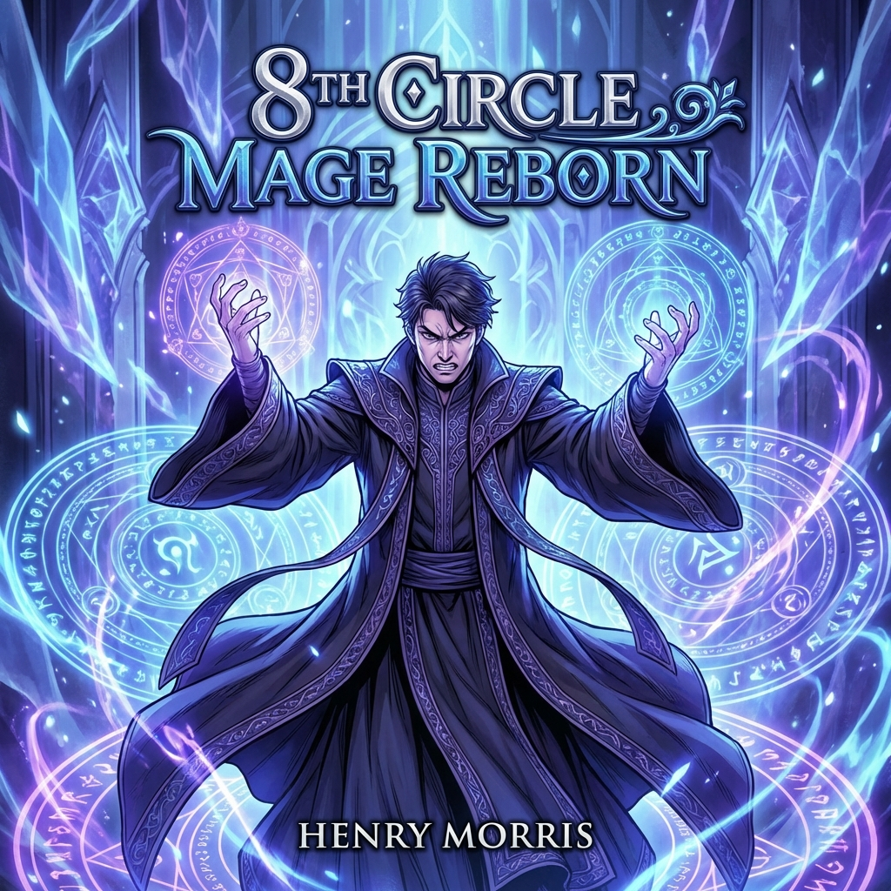

# 8th Circle Mage Reborn

| | |
|---|---|
| Original Title | 8서클 마법사의 환생 (8 Circle Mabeopsa-ui Hwansaeng) |
| Alternative Title | The Rebirth of an 8th-Circled Wizard / Return of the 8th Circle Mage |
| Release Year | 2020 |
| Author | Zary |
| Artist | Studio Inus / chleo |
| Origin | 🇰🇷 Manhwa |
| Genre | Action / Fantasy / Magic / Regression |
| Status | Completed |
| Chapters Read | 160 / 160 (Completed) |
| Start Date | 3rd February 2026 |
| End Date | 7th February 2026 |
| Rating | 7.68/10 |
| Platform | Mihon |

## Overview

"8th Circle Mage Reborn" follows Henry Morris, an 8th-circle wizard who is executed under false accusations of treason. After his death, he is reborn into a new body with all his magical knowledge and memories intact. Now, armed with the power of an 8th-circle mage in a younger body, Henry seeks revenge against those who betrayed him and aims to change his tragic fate.

*This is a classic regression/reincarnation revenge story with a magic-focused power system. The series completed its run on December 6, 2023, with a total of 160 chapters.*

## Story & World

The world operates on a circle-based magic system, where mages advance through circles (1st to 9th), with each circle representing a significant leap in power. The 8th Circle is considered legendary, with very few mages ever reaching it. The series does a solid job establishing the power hierarchy and the political intrigue surrounding high-level mages.

## Characters

**Henry Morris** - The protagonist, an 8th Circle mage who regressed to his younger self after being executed for false treason charges. Armed with future knowledge and magical mastery, he's determined to change his fate and exact revenge. His character shows more depth than typical revenge protagonists, balancing his desire for vengeance with strategic thinking and occasional moments of vulnerability.

## Art & Presentation

Studio Inus and chleo delivered strong visuals throughout the series. The magic circles are beautifully detailed, and the action sequences have good flow and impact. Character designs are distinct and the panel composition keeps the reading experience smooth. The art quality remains consistent across all 160 chapters, which is impressive.

*Rating: 8.3/10*

## Themes & Impact

-   **Regression/Second Chance**: Classic time regression trope
-   **Revenge**: Protagonist seeks vengeance against those who betrayed him
-   **Power Fantasy**: OP protagonist with future knowledge
-   **Magic System**: Circle-based progression system

## Personal Notes & Observations

Binged all 160 chapters in 5 days—that should tell you how engaging it was. The series hits all the right notes for a regression fantasy without overstaying its welcome. The magic system is well-explained, the revenge plot is satisfying, and the pacing keeps you hooked. It's formulaic, sure, but it's executed well enough that you don't really mind.

### Rating Breakdown

| Category | Score | Notes |
|---|---|---|
| **Artwork** | **8.3/10** | Strong visual presentation |
| **Plot** | **7.1/10** | Solid revenge/regression narrative |
| **Story** | **6.9/10** | Engaging but somewhat predictable |
| **Character Development** | **7.8/10** | Good character growth |
| **Enjoyment** | **8.0/10** | Highly enjoyable read |
| **Pace** | **8.0/10** | Well-paced, kept me engaged |
| **Overall** | **7.68/10** | **Completed** |

## Verdict

Honestly, this was a pretty solid read that I binged through in just 5 days. The artwork is definitely the standout here—Studio Inus/chleo did a great job with the visuals, making the magic circles and action scenes look really impressive. That 8.3 rating for artwork is well-deserved.

The story itself is your typical regression revenge fantasy, which is why the plot and story scores are a bit lower (7.1 and 6.9). It's not breaking new ground or anything—you've seen this formula before if you've read other regression manhwa. Betrayed powerful mage gets a second chance, knows the future, and starts stomping everyone. Predictable? Yeah. But still engaging enough to keep me hooked.

What surprised me was the character development (7.8). For a power fantasy series, the characters actually get some decent growth and aren't just one-dimensional cardboard cutouts. The MC isn't just an edgelord out for revenge; there's some nuance there.

The real kicker is the enjoyment factor—solid 8.0. Despite being somewhat formulaic, it's just *fun* to read. The pacing keeps you turning pages, the magic system is interesting with the circle progression, and watching an OP mage flex on everyone never gets old. It's comfort food in manhwa form.

**Overall: 7.68/10** - A well-executed regression fantasy that doesn't reinvent the wheel but delivers exactly what it promises. If you're into magic-focused power fantasies with good art and a revenge plot, you'll probably enjoy this as much as I did.

-   **Started Reading**: 3rd February 2026
-   **Completed**: 7th February 2026 (160 chapters in 5 days)

---

## Reread Value

**Would I reread?** Probably not. It's a fun one-time read, but once you know how the revenge plot unfolds, there's not much reason to revisit it. The enjoyment comes from the initial discovery and seeing the MC outplay everyone.

**Best for:** Fans of regression/reincarnation stories, magic-focused power systems, and OP protagonists with future knowledge.

**Similar series:**
- The Beginning After the End (Manhwa - Reincarnation, magic system, OP MC)
- The Great Mage Returns After 4000 Years (Manhwa - Powerful mage returns)
- Archmage Streamer (Manhwa - Regression with magic)
- Return of the Disaster-Class Hero (Manhwa - Regression, revenge)
- SSS-Class Suicide Hunter (Manhwa - Regression with unique power system)
