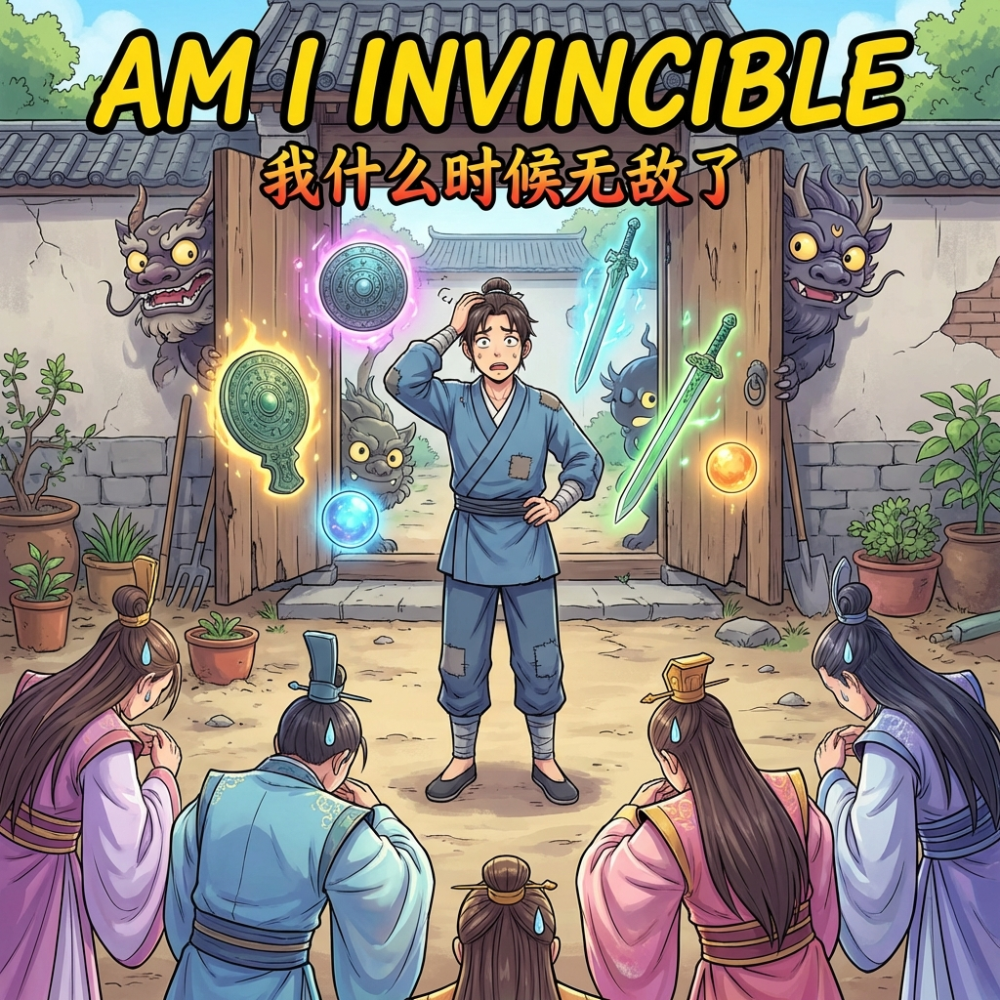

# Am I Invincible

| | |
|---|---|
| Original Title | 我什么时候无敌了 (Wǒ Shénme Shíhòu Wúdíle) |
| Alternative Title | When Did I Become Invincible? / When Did I Become Unbeatable? / Since When Am I Invincible |
| Release Year | 2023 |
| Author | Xì Liǔ Xiānshēng / Bilibili |
| Artist | Xì Liǔ Xiānshēng / Bilibili |
| Origin | 🇨🇳 Manhua |
| Genre | Action / Comedy / Fantasy / Murim |
| Status | Completed |
| Chapters Read | 315 / 315 |
| Start Date | 9th November 2024 |
| End Date | 3rd February 2026 |
| Rating | 6.92 / 10 |
| Platform | Mihon |

## Overview

"Am I Invincible" follows a protagonist who is unknowingly overpowered. He believes he is a mortal surrounded by cultivating experts, while in reality, he is the most powerful being around. The story revolves around the comedic misunderstandings that ensue as he interacts with the cultivation world, often resolving major crises by accident or through simple actions he deems mundane.

I can relate this Manhua to the anime *Overlord*. Actually, the Protagonist is more clueless than Ainz. He didn't even know what he did and why everyone keeps calling him a senior. Also the Protagonist has so many alternative names that I forgot what he was called to begin with.

## Story & World

The story is set in a cultivation world (Murim/Xianxia) filled with sects, demons, and immortals. The main character resides in a small courtyard that is actually a supreme holy land, filled with supreme artifacts and mythical beasts he treats as ordinary household items and pets.

> Although the plot is very shallow, the Artwork and character development makes up for it... **until chapter 278.**

The narrative is driven by the absurd gap between what the protagonist perceives and what is actually happening. This creates a constant stream of humor and surprisingly satisfying moments where his "mundane" actions inadvertently solve world-ending conflicts.

**However, after chapter 278, the series takes a nosedive.** The introduction of cross-dressing and gender mutilation themes completely derailed what was otherwise a fun, lighthearted comedy. These elements felt forced, unnecessary, and completely out of place with the established tone. What started as an enjoyable misunderstanding-based comedy became uncomfortable and frustrating to read.

## Characters

**Protagonist** - A "mortal" who is actually an invincible existence. He is humble, cautious, and completely oblivious to his own strength. His cluelessness is even greater than Ainz from Overlord.

## Art & Presentation

Typical manhua art style, but executed well. The comedic timing in panels is good, and the action sequences are vibrant.

*Rating: 8.3/10*

## Themes & Impact

-   **Perception vs. Reality**: The core comedic premise.
-   **Humility (Unintentional)**: The protagonist's lack of awareness ironically makes him appear as a humble, all-knowing master.
-   **Power Fantasy (Inverted)**: Unlike typical power fantasies, the fun comes from the MC *not* knowing he's powerful.

## Personal Notes & Observations

This Manhua is Very Fun to read. It's easy going and relaxing.

### Rating Breakdown

| Category | Score | Notes |
|---|---|---|
| **Artwork** | **8.3** | Vibrant and comedic throughout. |
| **Plot** | **4.2** | Very shallow, and completely falls apart after ch. 278. |
| **Story** | **5.1** | Strong comedic premise ruined by terrible final arc. |
| **Character Development** | **6.5** | Good until ch. 278, then characters act completely OOC. |
| **Enjoyment** | **6.8** | First 278 chapters were great (9/10), last 37 were awful (2/10). |
| **Overall** | **6.92** | **Decent Series** (would've been 8+ without the ending) |
| **Pace** | **Inconsistent** | Breezy and fun until the disastrous final arc |

## Verdict

**Chapters 1-278:** Honestly? Pure fun. It's one of those manhua where you can turn your brain off and just enjoy the ride. The plot's paper-thin, sure, but the comedy hits hard and the art is surprisingly solid. The MC is hilariously clueless—like, even more than Ainz from Overlord. Watching everyone treat him like some legendary senior while he's just trying to live a quiet life is comedy gold.

**Chapters 278-315:** A complete disaster. The series introduces cross-dressing and gender mutilation themes that are absolutely abhorrent and completely unnecessary. These elements destroyed the lighthearted comedy vibe and made the final arc genuinely uncomfortable to read. Characters started acting completely out of character, and the story lost all sense of direction.

**Final Verdict:** I only finished it because I had 30-40 chapters left when it went downhill. If you're going to read this, I'd honestly recommend stopping at chapter 278 and pretending that's the ending. The first 278 chapters would've been an easy 8-8.5/10, but the final arc drags the entire series down significantly.

-   **Re-started Reading**: Picked back up at Chapter 154 on November 2024, then continued at Chapter 169 on 31st January 2026 after the series completed its run.
-   **Completed**: Finished all 315 chapters on 3rd February 2026. Unfortunately, the series completely fell apart after chapter 278 with the introduction of cross-dressing and gender mutilation themes that I absolutely abhor. Only finished it because I had ~37 chapters left. Would've been a much better series if it ended at chapter 278.

---

## Reread Value

**Would I reread?** Maybe chapters 1-278 only. The final arc is a hard skip.

**Best for:** Fans of "OP MC who doesn't know he's OP" tropes and misunderstanding-based comedy. Similar to Overlord in concept. **WARNING:** Contains problematic content after chapter 278 (cross-dressing/gender mutilation themes).

**Similar series:**
- I'm Actually a Cultivation Bigshot (Manhua - OP MC who thinks he's mortal, comedy misunderstandings)
- I'm Really Not The Demon God's Lackey (Manhua - Normal human misunderstood as god-like being)
- Beyond Myriad Peoples (Manhua - Clueless OP MC running martial arts gym)
- The Unmatched Powerhouse Just Wants To Farm (Manhua - OP farmer unaware of his power)
- The Eminence in Shadow (Manhwa adaptation - Clueless OP MC comedy)
