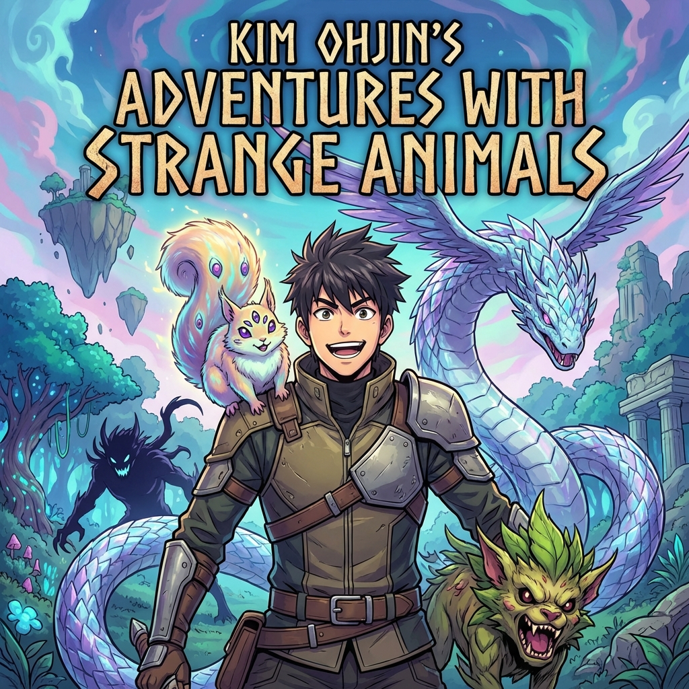

# Kim Ohjin's Adventures with Strange Animals

[MangaUpdates](https://www.mangaupdates.com/series/k0p99xp/kim-ohjin-s-adventures-with-strange-animals)

| | |
|---|---|
| Original Title | 김오진과 이상한 동물들 |
| Alternative Title | Kim O-jin and the Strange Animals / Vet in Another World: Kim Oh-jin and His Fantastic Beasts / Dr. Kim's Odd Creatures |
| Release Year | 2025 |
| Author | Kisun |
| Artist | Pilsallin |
| Origin | 🇰🇷 Manhwa |
| Genre | Adventure / Comedy / Fantasy / Slice of Life |
| Status | On Hold (Waiting for Next Release — Monthly) |
| Chapters Read | 46 / Ongoing |
| Chapters (Raw) | 46 |
| Chapters (English) | 46 |
| Start Date | 30th January 2026 |
| Last Read | 2nd February 2026 |
| End Date | - |
| Rating | 4.87/10 |
| Platform | Mihon |

## Overview

*Kim Ohjin's Adventures with Strange Animals* follows veterinarian Kim Ohjin, who was unexpectedly summoned by a dragon. After successfully treating the dragon’s pet, he returns home — only to find himself in another world. His old clinic was on the verge of closing, but here, in this strange new world, he’s a renowned doctor. Now he’s setting his sights on a second clinic and, hopefully, a big success.

## Story & World

*(To be updated as I continue reading)*

The series opens with Kim Ohjin, a struggling veterinarian in the modern world, on the brink of financial ruin. His life takes a dramatic turn when he's summoned to another world by a dragon who needs his expertise to treat a sick pet. This premise immediately sets up an interesting dynamic—a modern veterinarian applying real-world medical knowledge to fantastical creatures.

The fantasy world is populated with magical beasts and creatures that require specialized care, creating endless opportunities for creative storytelling. Ohjin's practical veterinary skills become invaluable in a world where such expertise is rare, allowing him to carve out a unique niche as a doctor for strange animals.

The series balances adventure with slice-of-life elements, as Ohjin navigates both the challenges of treating exotic magical creatures and establishing his second clinic in this new world. The comedy comes naturally from the absurdity of applying modern veterinary practices to dragons, mythical beasts, and other fantastical animals.

## Characters

*(To be updated as I continue reading)*

**Kim Ohjin** - The protagonist, a 32-year-old veterinarian who brings modern medical knowledge to a fantasy world. His practical, down-to-earth approach to treating magical creatures provides both humor and heart to the series.

The supporting cast includes various magical creatures and their owners, each presenting unique medical challenges and personality quirks that keep the story fresh and engaging.

## Art & Presentation

*(To be updated as I continue reading)*

As a webtoon, the series utilizes vertical scrolling format typical of Korean manhwa. Philsallin's art style brings the fantasy creatures to life while maintaining clarity in the medical procedures and comedic moments.

## Themes & Impact

*(To be updated as I continue reading)*

Early themes emerging:
- **Second chances**: Ohjin gets a fresh start in a new world after facing failure
- **Expertise and value**: How specialized knowledge can be valuable in unexpected contexts
- **Compassion**: Caring for creatures regardless of how strange or dangerous they might be
- **Adaptation**: Applying modern knowledge to fantasy settings

## Personal Notes & Observations

*(Raw thoughts as I read)*

### Rating Breakdown

| Category | Score | Notes |
|---|---|---|
| **Artwork** | **8.2** | Good art quality, well-drawn creatures |
| **Plot** | **3.2** | Very shallow and predictable |
| **Story** | **4.0** | Interesting premise but weak execution |
| **Character Development** | **5.5** | Decent but nothing special |
| **Enjoyment** | **3.3** | Hit or miss, often boring |
| **Pace** | **5.0/10** | Sometimes boring, sometimes fun |
| **Overall** | **4.87/10** | **Mediocre** |

## Verdict

*(To be written upon completion)*

- Unique premise combining veterinary medicine with fantasy adventure
- The concept of a modern vet treating magical creatures is fresh and entertaining
- Good balance of comedy, adventure, and heartwarming moments
- Currently 46 chapters in and enjoying the journey
- The series maintains its charm and unique premise

### Memorable Moments So Far

*(Will update as I continue reading)*

- The initial summoning by the dragon
- Ohjin's decision to establish a clinic in the fantasy world

---

## Reread Value

**Would I reread?** (To be determined after completion)

**Best for:** Readers who enjoy fantasy with unique premises, slice-of-life elements, and lighthearted adventure

**Similar series:** 
- The Legendary Beasts Animal Hospital (Manhwa - Veterinarian treating mythical creatures)
- Doctor Elise: The Royal Lady with the Lamp (Manhwa - Medical professional in fantasy world)
- Survival Story of a Sword King in a Fantasy World (Manhwa - Comedy + Fantasy adventure)

---

## Additional Context

"Kim Ohjin's Adventures with Strange Animals" is serialized on Naver Webtoon, one of Korea's premier webtoon platforms. The series combines the popular isekai (transported to another world) trope with a unique veterinary medicine angle, setting it apart from typical fantasy manhwa.

The manhwa is ongoing, with new chapters released regularly. It has gained popularity for its fresh take on the fantasy genre and its heartwarming approach to the relationship between healers and their patients—even when those patients are dragons and magical beasts.

---
