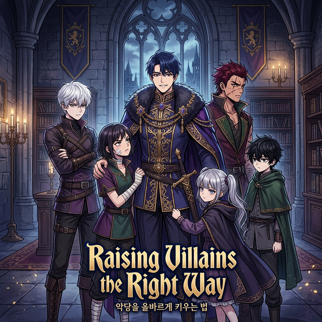

# Raising Villains the Right Way

| | |
|---|---|
| Original Title | 악당들의 후원자가 되었다 |
| Alternative Title | Became the Patron of Villains / I Became the Patron of Villains / Became a Supporter of Villains |
| Release Year | 2025 |
| Author | Bomhan Bangul, LICO |
| Artist | Jogen |
| Origin | 🇰🇷 Manhwa |
| Genre | Action / Comedy / Drama / Fantasy / Shounen |
| Status | On Hold (Waiting for Next Release — Weekly) |
| Chapters Read | 24 / Ongoing |
| Chapters (Raw) | 25 |
| Chapters (English) | 25 |
| Start Date | 27th February 2026 |
| Last Read | 27th February 2026 |
| End Date | - |
| Rating | 8.2/10 |
| Platform | Mihon |

## Overview

*Raising Villains the Right Way* drops a corporate drone straight into the world of a fantasy RPG called "Psychedelia" — but not as the hero. He reincarnates as Alan Palasio, a minor noble extra with a death flag stamped on his forehead: he's destined to be killed by the kingdom's five future great villains, the "Five Great Sins." His solution? Get ahead of the curve. Instead of running or fighting, he hunts down these future villains *while they're still kids* — damaged, troubled, with tragic backstories that would turn anyone bitter — and sponsors them. Mentors them. Raises them right.

The twist? His very success at preventing their villainous turns ends up putting himself on the path to becoming the kingdom's final boss.

## Story & World

The world of Psychedelia is a turn-based RPG setting brought to life, and the story leverages Alan's metagame knowledge brilliantly. Rather than the usual power-fantasy isekai loop, the narrative's hook is genuinely clever: what happens when you fix the villains? The story plays with cause and effect in ways that feel thought-through rather than arbitrary. The early chapters do a great job laying the groundwork — each of the Five Great Sins has their own circumstances, and watching Alan navigate those before they go off the rails is compelling stuff.

## Characters

**Alan Palasio (Protagonist)** — A corporate wage slave reborn into nobility. Pragmatic, self-aware, and ahead of everyone else thanks to his foreknowledge. The character is refreshing because he's not trying to be a hero — he's just trying to survive, and the heroism is almost accidental. His dry wit and deadpan reactions to ridiculous situations make him very likable.

**The Five Great Sins** — Each of the future villains has their own distinct personality and circumstances. The joy of early reading is getting glimpses of who they are before Alan starts intervening — tragic backstories that actual feel earned rather than just used for shock value.

## Art & Presentation

*Rating: 8.5/10*

LICO's art is clean and polished — the character designs are expressive and varied. The aesthetic has that premium manhwa sheen with detailed backgrounds and dynamic paneling.

## Themes & Impact

- **Nature vs. Nurture**: Can people fundamentally change with the right environment and guidance?
- **Preemptive Compassion**: Fixing problems at the root before they become catastrophes
- **The Irony of Good Intentions**: Doing the right thing and ending up the villain anyway
- **Metagame Knowledge as Burden**: Knowing the future isn't power; it's responsibility

## Personal Notes & Observations

### Progress Update - Start (27th February 2026)

Just cracked this open and it already has my full attention. The premise alone is a cut above the usual isekai slop — reincarnating as a *side character* who decides to preemptively mentor the future villains is a genuinely original spin. The execution so far is matching the promise. Alan feels like a real person with actual wit, not just an OP blank slate. Very early days but the vibe is excellent.

### Rating Breakdown

| Category | Score | Notes |
|---|---|---|
| **Artwork** | **8.5/10** | Clean, polished manhwa art with expressive character designs and strong paneling |
| **Plot** | **8.5/10** | Genuinely clever premise — fixing the villains before they snap, with real cause-and-effect consequences |
| **Story** | **8.0/10** | Tight and focused early on; the irony of Alan becoming the final boss is a great hook |
| **Character Development** | **8.0/10** | Alan is witty and grounded; the Five Great Sins already feel distinct and earned |
| **Enjoyment** | **8.5/10** | Absolutely hooked — hasn't had a single dull moment through 24 chapters |
| **Pace** | **7.5/10** | Moves well, though too early to judge long-term pacing |
| **Overall** | **8.2/10** | **Exceptional start — one of the more original isekai premises in a while** |

## Verdict

*To be written.*

---

## Reread Value

**Would I reread?** TBD

**Best for:** Fans of clever isekai with morally interesting premises, villain rehabilitation arcs, and protagonists who use their brains over brute force.

**Similar series:**

*In this archive:*
- [Heavenly Grand Archive's Young Master](../titles/heavenly_grand_archives_young_master.md) (Manhwa) — Metagame knowledge + reincarnated noble using foreknowledge tactically; very similar smart-protagonist energy
- [I Shall Live as a Prince](../titles/i_shall_live_as_a_prince.md) (Manhwa) — Reincarnated nobleman using future knowledge to steer history away from disaster; same "brains over brawn" philosophy
- [8th Circle Mage Reborn](../titles/8th_circle_mage_reborn.md) (Manhwa) — Reincarnated powerhouse navigating a world he knows inside-out; shares the foreknowledge-as-advantage hook

*Worth checking out:*
- **He Reincarnated as a Trash Noble… and Adopts the Five Villains Who Will Doom the Kingdom!** (Manhwa) — Nearly the same premise: noble with game knowledge raising future villains as kids to prevent the kingdom's fall; basically the closest spiritual twin
- **Lout of Count's Family** (Manhwa) — Reincarnated as the novel's minor villain noble; uses foreknowledge and zero interest in fighting to navigate a world on the brink of destruction; same "brains and foresight over brawn" DNA
- **The Villainess Lives Again** (Manhwa) — Villainess gets a second chance and uses her cunning to steer events toward a better outcome; very sharp protagonist with a similarly ironic self-awareness
- **Death Is the Only Ending for the Villainess** (Manhwa) — Reincarnated into a reverse-harem otome game as the villainess in hard mode; high-stakes navigation of pre-written villain fate with a compelling lead
