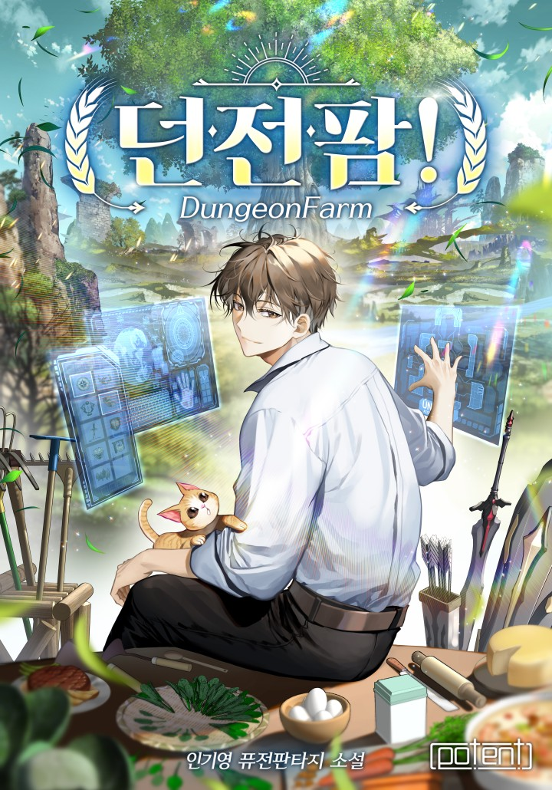

# The Top Dungeon Farmer

| | |
|---|---|
| Original Title | 나 혼자 탑에서 농사 (Na Honja Tap-eseo Nongsa) |
| Alternative Title | Solo Farming in the Tower / Farming in the Tower Alone |
| Release Year | 2023 |
| Author | sdcknight |
| Artist | Lee Ha-kyung |
| Origin | 🇰🇷 Manhwa |
| Genre | Fantasy / Isekai / Slice of Life / Adventure |
| Status | Currently Reading |
| Chapters Read | 0 / Ongoing (Season 2) |
| Start Date | 16th February 2026 |
| Last Read | 16th February 2026 |
| End Date | - |
| Rating | TBD |
| Platform | WEBTOON / Mihon |

## Overview

*(To be updated as I continue reading)*

"The Top Dungeon Farmer" (also known as "Solo Farming in the Tower") is a unique twist on the dungeon crawler genre. Instead of the typical adventurer role, the story follows Sejun, an ordinary Seoul resident who unexpectedly finds himself trapped in a mysterious dungeon and becomes... a farmer. Rather than battling monsters, he focuses on cultivating and selling cash crops while completing various quests and surviving with optimism, resourcefulness, and the help of loyal monster companions.

## Story & World

*(To be updated as I continue reading)*

The story explores farming and survival within a fantasy dungeon setting, blending slice-of-life elements with dungeon adventure.

## Characters

*(To be updated as I continue reading)*

**Sejun (Protagonist)** - An ordinary Seoul resident who becomes an unlikely farmer in a mysterious dungeon tower.

## Art & Presentation

*(To be updated as I continue reading)*

Full-color manhwa available on WEBTOON with weekly releases.

*Rating: TBD*

## Themes & Impact

*(To be updated as I continue reading)*

Early themes emerging:
- **Survival & Adaptation**: Making the best of an impossible situation
- **Unconventional Problem-Solving**: Farming instead of fighting
- **Resourcefulness**: Using what's available in creative ways
- **Companionship**: Building relationships with monster allies

## Personal Notes & Observations

*(Raw thoughts as I read)*

Just started reading this series on 16th February 2026. Intrigued by the unique premise of dungeon farming instead of typical monster hunting.

### Rating Breakdown

| Category | Score | Notes |
|---|---|---|
| **Artwork** | **TBD** | - |
| **Plot** | **TBD** | - |
| **Story** | **TBD** | - |
| **Character Development** | **TBD** | - |
| **Enjoyment** | **TBD** | - |
| **Pace** | **TBD** | - |
| **Overall** | **TBD** | - |

## Verdict

*(To be written as I continue reading)*

Just started this series. Will update with thoughts as I progress.

### Memorable Moments So Far

*(Will update as I continue reading)*

---

## Reread Value

**Would I reread?** (To be determined)

**Best for:** Fans of farming manga/manhwa, slice-of-life isekai, unconventional dungeon stories, and cozy fantasy adventures.

**Similar series:**
- TBD

---

## Additional Context

Based on a web novel by sdcknight. The manhwa adaptation is serialized on WEBTOON with weekly releases. Season 1 concluded with episode 100 on June 11, 2025, and Season 2 premiered on February 11, 2026.

---
